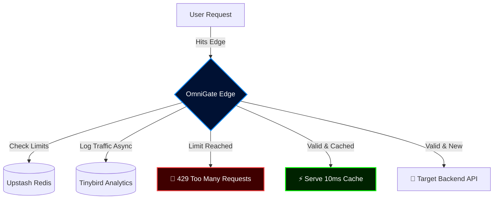

  
  
  <h1>OmniGate 🚀</h1>
  
<b>The 10ms Self-Hosted Edge API Gateway.</b>

  <a href="https://omnigatev1.vercel.app">Live Demo</a> •
  <a href="#-quick-start">Quick Start</a> •
  <a href="#-architecture">Architecture</a>

   
   

  
  
  
  
  

---

## 🛑 The Problem
Enterprise API gateways like Kong or AWS API Gateway are incredibly powerful—and incredibly exhausting. They require dedicated DevOps teams, complex YAML configurations, and steep learning curves just to rate-limit a simple endpoint.

## ⚡ The Solution
**OmniGate** is a drop-in, headless API Gateway built entirely on Next.js 15 and Vercel Edge. It gives indie hackers and mid-sized teams enterprise-grade infrastructure—global rate limiting, sub-10ms edge caching, and real-time telemetry—deployed in exactly 60 seconds.

Stop wrestling with infrastructure. Build the shield first, then build your app.

  

---

## ✨ Superpowers (Core Features)

OmniGate doesn't just route traffic; it acts as a shock absorber for your backend.

- **🛡️ Zero-Trust Edge Rate Limiting:** Prevent accidental (or malicious) DDoS attacks with strict sliding-window rate limits evaluated at the Vercel Edge using Upstash Redis.
- **⚡ Sub-10ms Edge Caching:** Intercept repetitive `GET` requests at the edge. Serve cached responses in milliseconds without ever waking up your main database.
- **🔄 Zero-Downtime Auto-Retries:** If your target backend temporarily crashes (502/503), OmniGate catches the failure, holds the connection, and silently retries the request in the background. Your users never see the error.
- **🔥 Native API Sandbox:** A world-class, Stripe-inspired developer experience. Generate a key and test your proxy routes directly inside the dark-mode dashboard UI.
- **📊 Real-Time Firehose:** Asynchronous, non-blocking telemetry securely logs latency, status codes, and traffic data into Tinybird without adding a single millisecond to your request times.

---

## 🏗️ Architecture

OmniGate utilizes a globally distributed architecture to intercept traffic as physically close to your users as possible.

---

## 🛠️ The Tech Stack

OmniGate is built on the bleeding edge of serverless technology:

- **Framework:** [Next.js 15](https://nextjs.org/) (App Router & Edge Runtime)
- **Database / Auth:** [Supabase](https://supabase.com/) (PostgreSQL)
- **In-Memory Cache:** [Upstash](https://upstash.com/) (Serverless Redis)
- **Telemetry Data Warehouse:** [Tinybird](https://tinybird.co/) (ClickHouse)
- **Styling:** Tailwind CSS, Framer Motion, Lucide Icons, Sonner

---

## 🤝 Contributing

Contributions are what make the open source community such an amazing place to learn, inspire, and create. Any contributions you make are **greatly appreciated**.

1. Fork the Project
2. Create your Feature Branch (`git checkout -b feature/AmazingFeature`)
3. Commit your Changes (`git commit -m 'Add some AmazingFeature'`)
4. Push to the Branch (`git push origin feature/AmazingFeature`)
5. Open a Pull Request

---

## 📄 License

Distributed under the MIT License. See `LICENSE` for more information.
